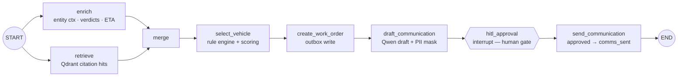
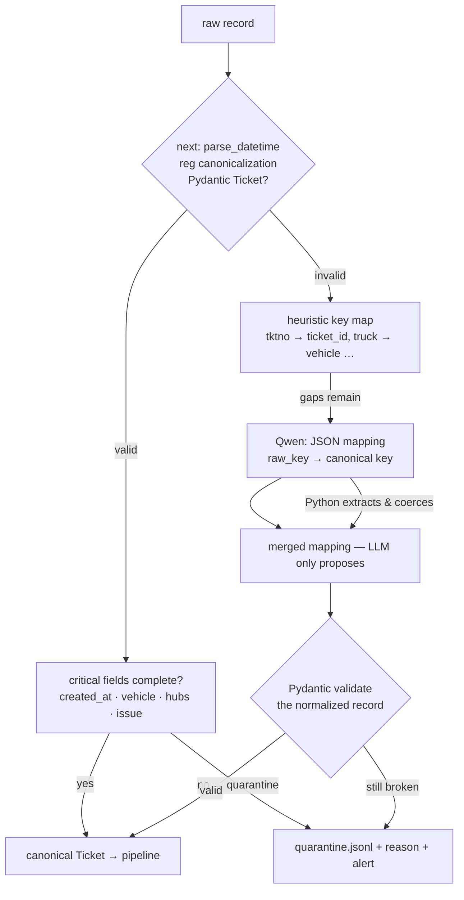
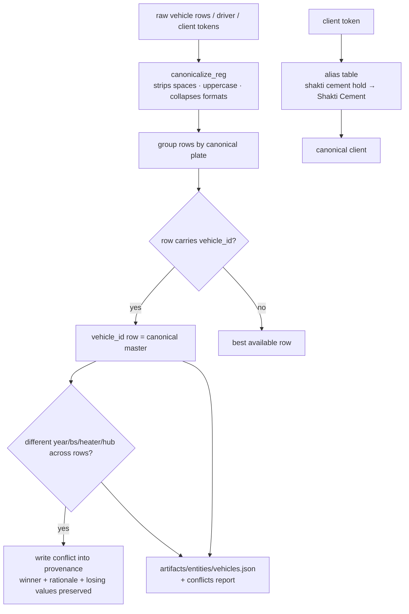
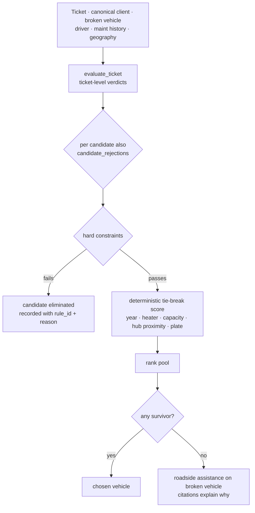
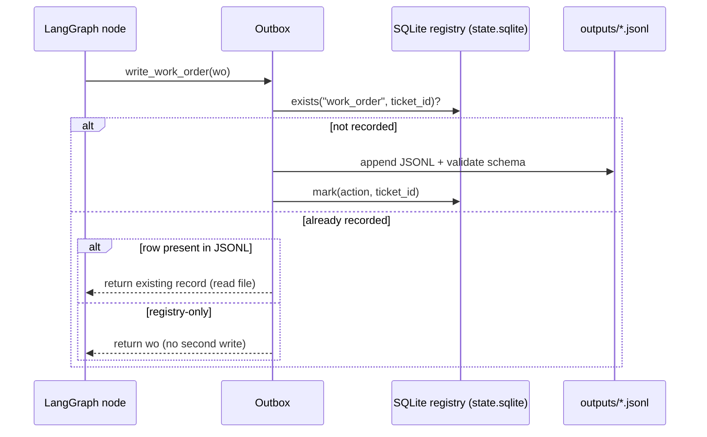

# SynqAI — Meridian Freight: Breakdown → Resolution

An AI **operations console** for Meridian Freight. It consumes a raw breakdown-ticket
queue, deduplicates and rescues broken records, resolves messy entities, applies the
retiring dispatcher's 15 dispatch rules _deterministically_, selects a replacement
vehicle, drafts a client communication, gates it behind a human approval, and writes
an exactly-once, fully replayable audit trail of every decision.

> The dispatcher's knowledge is **not** magic — it is extracted into a versioned,
> inspectable rule catalog and executed by deterministic Python. The LLM (Qwen on
> Groq) is used only where ambiguity genuinely exists: reading a brand-new file
> format and drafting client-facing prose. Every decision and every byte of output
> is reproducible.

---

## Quick start

```bash
make setup        # create .venv + install deps (reads .env if present)
make build        # build knowledge store (chunks -> local embeddings -> Qdrant)
make run          # full pipeline over data/tickets.json (auto-approves drafts)
make verify       # prove idempotency: run twice, diff business-truth output
make api          # FastAPI service (introspection + approval surface)
make dashboard    # Streamlit operations console — the interactive demo surface
make test         # pytest
```

`make run` is the primary entry point. It is a **pure function of the queue file**:
re-running it produces byte-identical `outputs/` and `audit/` files (see
`scripts/verify_idempotent.py`). The only field that changes across replays is the
audit log's wall-clock `at` stamp (pure provenance, not a decision).

---

## What the system does

1. **Load & validate** — native type loaders, Pydantic validation (`app/ingest/`).
2. **Deduplicate** — first occurrence wins; sync-copy duplicates collapse.
3. **Schema recovery** — a record that fails validation is fed to Qwen, which
   *suggests* the key-to-key mapping; **Python** performs the extraction and
   re-validation (`app/ingest/schema_recovery.py`). Qwen can never inject a value.
4. **Quarantine** — records still broken after rescue are quarantined **with a
   reason and an alert**, never silently dropped, never a crash.
5. **Enrich** — canonical entities for vehicle / driver / client / maintenance /
   trip history / geography / SLA, every fact carrying a citation
   (`app/pipeline/enrich.py`).
6. **Retrieve** — grounded knowledge retrieval against Qdrant for citations
   (`app/pipeline/retrieve.py`). Used for evidence, never for rule execution.
7. **Apply dispatcher rules** — 15 rules extracted from Rajender's interview + the
   40 email threads, compiled to `app/rules/rules.yaml`, executed deterministically
   (`app/rules/engine.py`).
8. **Select replacement** — rule-first eligibility with a deterministic tie-break,
   and a **documented elimination for every rejected candidate**
   (`app/pipeline/select_vehicle.py`).
9. **Work order** — exactly one per unique valid ticket via an **outbox pattern**
   (`app/pipeline/outbox.py`).
10. **Client comms draft → HITL gate** — a draft is queued, then the graph pauses at
    an `interrupt()`; it is sent only after a human approves (`app/pipeline/comms.py`,
    `app/pipeline/graph.py`).
11. **Audit** — every decision is replayable through `audit/audit.jsonl` + the SQLite
    graph checkpointer + per-node JSON artifacts under `artifacts/graph/<thread_id>/`
    + the LangSmith trace id (provenance only, never in business truth).

---

## System architecture

```mermaid
flowchart TB
    subgraph INPUT["INPUT"]
        Q[data/tickets.json<br/>+ surprise file]
    end

    subgraph PIPELINE["LANGGRAPH PIPELINE  app/pipeline/"]
        PRE[Preprocess<br/>validate · dedupe · schema-recovery · quarantine]
        GRAPH[Per unique valid ticket<br/>enrich ∥ retrieve → merge → select_vehicle →<br/>create_work_order → draft_comm → HITL → send]
    end

    subgraph CONTEXT["KNOWLEDGE & CONTEXT  app/knowledge/"]
        DOCS[dispatcher_interview.txt<br/>emails/ (40)<br/>maintenance_log.xlsx]
        CHUNKS[Chunking<br/>artifacts/knowledge/chunks.jsonl]
        EMB[Local embeddings<br/>granite-embedding-97m multilingual 384-d]
        QD[Qdrant Cloud<br/>synqai_knowledge + synqai_userkb]
        ENT[Entity registries<br/>fleet · drivers · clients · hubs]
    end

    subgraph RULES["RULE ENGINE  app/rules/"]
        YAML[rules.yaml — 15 rules]
        PY[Deterministic Python engine]
    end

    subgraph LLM["LLM RUNNER  Qwen on Groq"]
        SR[Schema recovery — mapping only]
        COMMS[Comms drafting — tone only]
    end

    subgraph IDEM["EXACTLY-ONCE CORE"]
        OUTBOX[Outbox writers<br/>SQLite registry + JSONL scan]
        STATE[(state.sqlite<br/>graph checkpointer)]
    end

    Q --> PIPELINE
    DOCS --> CHUNKS
    CHUNKS --> EMB --> QD
    QD --> GRAPH
    ENT --> GRAPH
    YAML --> PY
    PY --> GRAPH
    SR --> PRE
    COMMS --> GRAPH
    PIPELINE --> IDEM
    GRAPH --> STATE

    subgraph EGRESS["EGRESS"]
        WO[outputs/work_orders.jsonl]
        CG[outputs/comms_pending.jsonl]
        CS[outputs/comms_sent.jsonl]
        QU[outputs/quarantine.jsonl]
        AU[audit/audit.jsonl]
        AR[artifacts/ — per-node JSON]
    end

    OUTBOX --> EGRESS
    GRAPH --> EGRESS

    subgraph SERVE["SERVE"]
        API[FastAPI  app/api/main.py]
        DSB[Streamlit ops console  dashboard/app.py]
        LS[LangSmith tracing]
    end

    EGRESS --> API
    EGRESS --> DSB
    GRAPH --> LS
```

---

## How a ticket flows (per-ticket execution)

The LangGraph state machine for one unique valid ticket
(`app/pipeline/graph.py`, `StreamMode=updates`):



Key properties:

- `enrich` and `retrieve` run **in parallel** (`START → enrich`, `START → retrieve`),
  then join at `merge`.
- Every node writes a replay artifact `artifacts/graph/<thread_id>/<node>.json`
  with input state, output state, timing, prompt/LLM-debug and the LangSmith trace id.
- The graph pauses at `hitl_approval` for **every** PENDING draft. Approval is resumed
  with `Command(resume={"decision":"APPROVE"|"REJECT", "by": ...})` — from the CLI,
  the API, or the Streamlit HITL console.

---

## Ingestion, rescue and quarantine



- **Dedupe** runs first: `dedupe()` keeps the first occurrence per `ticket_id`;
  duplicates and `(sync copy)` variants collapse and are audited as
  `DUPLICATE_SKIPPED`.
- A record with a **missing** `ticket_id` is *not* dropped — it stays eligible for
  schema recovery, and is only quarantined if it remains impossible to identify.
- Quarantine is an **alert**, not a failure: the record lands in
  `outputs/quarantine.jsonl` with a human-readable reason, recovery status, and
  masked raw payload — and the pipeline continues.
- Heuristic table + Qwen mapping live in `app/ingest/schema_recovery.py`; the
  recovery of each record is persisted under `artifacts/schema/`.

---

## Knowledge pipeline (RAG for citations and evidence)

```mermaid
flowchart LR
    subgraph SRC["SOURCES"]
        I[dispatcher_interview.txt → section chunks]
        E[emails/thread_*.txt → one chunk per thread]
        M[maintenance_log.xlsx → one chunk per record]
    end
    SRC --> CH[deterministic chunking<br/>artifacts/knowledge/chunks.jsonl]
    CH --> IDX[chunk index.json<br/>count · sources · rule_candidates]
    CH --> EMB[local embeddings<br/>sentence-transformers · granite-97m multilingual]
    EMB --> QDV[Qdrant upsert<br/>uuid5(chunk_id) point ids — idempotent]
    QDV --> RET[Qdrant retrieve<br/>artifacts/retrieval/retr_*.json]

    RET --> DF["search_rich()<br/>cosine score · threshold · lexical rerank<br/>merged default+user KB"]
    DF --> API2[FastAPI /retrieval]
    DF --> PLAY[Retrieval Playground]
```

- **Rule execution and eligibility never depend on semantic search.** Qdrant holds
  the transcript and emails for *citations and comms grounding* only; rules are
  compiled YAML run by Python.
- Embedding is local via `sentence-transformers` (no per-token API cost), model
  cached across runs and never re-downloaded.
- The interactive **Knowledge Upload** page extracts text from TXT/PDF/DOCX/XLSX/CSV/
  JSON, previews deterministic chunks (with token counts + rule-candidate confidence),
  lets a judge edit/split/merge/delete chunks, and indexes into an **isolated**
  `synqai_userkb` collection — the baseline `synqai_knowledge` is never touched.

---

## Entity resolution



Precedence rules (documented in `app/knowledge/entities.py`, never a silent guess):

1. A fleet row that carries a `vehicle_id` is the canonical master; ID-less
   duplicate-format rows are alias copies.
2. Fleet master wins over email/hub claims for vehicle attributes
   (email thread_21 mandates verifying against the fleet master).
3. Maintenance log wins over yard-check odometer claims (email thread_22).
4. Client names resolve through an alias table; unknown names are kept verbatim.

---

## Rule engine

Rules are declared in `app/rules/rules.yaml` (id, severity, condition, action,
citation, client/season/route index) and **executed by deterministic Python**
(`app/rules/engine.py`). The catalog is exported to
`artifacts/rules/rules_export.jsonl` on every run.



| Rule | Severity | Effect |
|------|----------|--------|
| `R_ORIGIN_50KM` | hard | ≤50 km → replacement from origin hub only |
| `R_NEAREST_HUB` | hard | >50 km → nearest hub with an eligible vehicle |
| `R_NCR_BS6_WINTER` | hard | NCR routes in winter: BS6 only |
| `R_HILL_ENGINE_HEATER` | hard | Hill routes (Nov–Feb): engine heater required |
| `R_HILL_BRAKE_30D` | hard | No brake work in the last 30 days for hill dispatch |
| `R_OVERDUE_SERVICE_GROUNDED` | hard | Grounded; applied only on actual due-date evidence |
| `R_JUGAAD_7D` | hard | Active jogadi repair → home-region only, 7-day clock |
| `R_SHAKTI_36H` | hard | Shakti planned to 36h door-to-door |
| `R_VERTEX_6PM_GATE` | hard | Vertex→Ludhiana: after 18:00 → hold till morning gate |
| `R_ORION_2020` | hard | Orion: only 2020-or-newer vehicles |
| `R_APEX_ROTATION` | hard | Problem vehicle rotates off the next Apex dispatch |
| `R_MONSOON_EAST_PADDING` | hard | Monsoon east-of-Lucknow → ETA +20%, no standard SLA |
| `R_NEW_DRIVER_NIGHT` | heuristic | New driver (<6 mo) never solo on a night run |
| `R_DELIVERY_ELIGIBLE` | hard | Active, not broken itself, not already assigned |
| `R_CAPACITY_MATCH` | soft | Capacity ≥ load; preference when tonnage unknown |

Selection is **rule-first, deterministic tie-break**: every candidate that touched a
mandatory hub is checked, and every rejection is recorded as
`eliminations: [{candidate, hub, rule_id, reason}, …]` in the selection artifact —
so a judge can see *why not* as well as *why chosen*.

---

## Exactly-once, idempotency and safe failure



- The outbox is guarded by **both** a SQLite registry and a scan of the authoritative
  JSONL on startup — business truth wins, so nothing doubles and nothing is lost.
- `run_id` is derived from the queue hash; `sent_at` is the canonical ticket event
  time; `approved_by` is `Approver(auto)` under `--approve auto`. Replays are
  byte-identical by construction (`make verify` proves it with SHA-256 over the
  business-truth files).
- The API, sandbox, chaos and dashboard runs all build an **isolated workspace**
  under `sandbox/<run_id>/` (own outputs, audit, artifacts, SQLite) so interactive
  demo runs can never mutate the baseline.

---

## Audit & observability

Every step writes one JSONL line to `audit/audit.jsonl`:

```
{ at, run_id, thread_id, ticket_id, step, node, decision,
  data_refs, rule_ids, citations, actor, detail }
```

Plus, per run:

| Path | Contents |
|------|----------|
| `outputs/work_orders.jsonl` | `{work_order_id, ticket_id, vehicle_reg, created_at, citations}` |
| `outputs/comms_pending.jsonl` | Drafts awaiting HITL, full context + citations |
| `outputs/comms_sent.jsonl` | `{message_id, ticket_id, recipient, body, approved_by, sent_at}` |
| `outputs/quarantine.jsonl` | Broken records + reasons + masked raw payload |
| `outputs/run_summary.json` | Records / unique / duplicate / quarantine counts |
| `artifacts/graph/<thread_id>/*.json` | Per-node input/output/prompt/LLM-debug/timing |
| `artifacts/retrieval/retr_*.json` | Query, chunks, similarity scores, latency |
| `artifacts/entities/`, `artifacts/rules/`, `artifacts/schema/` | Resolution provenance |
| LangSmith | Full traces (trace id stored in artifacts, kept out of business truth) |

---

## PII policy

Personal data (phones, Aadhaar, driving licence) is masked **at ingestion**
(`app/ingest/masking.py`) *before* it touches the knowledge store, artifacts,
outputs or audit. The mask is re-applied to every outbound comms body as
defense-in-depth. Vehicle registration numbers are operational keys, not personal
data, and are preserved. The dashboard exposes an HTML/CSS-escaped viewer for
technical judges and the API serves driver PII as ids only.

---

## LLM policy

- **Single model** pinned in `.env`: `GROQ_MODEL` (default `qwen/qwen3.8-27b`, Groq).
- Qwen is used **only** for:
  1. Schema recovery — proposing key-to-key field mappings (Python extracts).
  2. Structured extraction context suggestions.
  3. Client communication drafting (tone; deterministic per-client templates are
     the offline fallback; every body re-passed through the PII masker).
- Duplicate detection, vehicle eligibility, rule execution, ETA estimation,
  idempotency and filtering are **deterministic Python** — always.

---

## API (FastAPI)

`make api` → `http://localhost:8000`

| Method | Path | Purpose |
|--------|------|---------|
| GET | `/health` | Live counts |
| GET | `/tickets` | Queue summary |
| GET | `/tickets/{id}/timeline` | Full replay for one ticket |
| GET | `/rules` | Rule catalog (`?severity=`) |
| GET | `/retrieval?query=…` | RAG search with citations |
| GET | `/audit` | Audit search (`?ticket_id=&node=&rule=`) |
| GET | `/approvals` | Pending HITL drafts |
| POST | `/approvals/{id}` | `{decision, by}` resumes the paused HITL interrupt |
| POST | `/tickets/{id}/process` | Run one ticket through the live pipeline |

---

## Dashboard (Streamlit operations console)

`make dashboard` → the interactive demo surface. **13 pages**, each explaining its
purpose in plain English, exposing underlying JSON/artifacts, and (where it makes
sense) driving the real pipeline through isolated sandboxed runs.

```mermaid
flowchart TD
    DB[Dashboard app.py] --> OV[Executive Overview<br/>pipeline status · quick actions]
    DB --> SB[Ticket Sandbox<br/>upload JSON/CSV · manual form · paste raw · run live<br/>execution time · tokens · retrieval · selection · work order]
    DB --> KU[Knowledge Upload<br/>TXT/PDF/DOCX/XLSX/CSV/JSON → preview chunks<br/>edit/split/merge/delete → index to synqai_userkb]
    DB --> LP[Live Pipeline<br/>animated nodes · click a node → input/output/prompt/<br/>retrieved context · rule ids · timing]
    DB --> TE[Ticket Explorer<br/>timeline scrubber · compare two tickets]
    DB --> KE[Knowledge Explorer<br/>chunks + filters · score · provenance · neighbors]
    DB --> RE[Rule Explorer + Simulator<br/>client/route/season/year/hub → decision tree of<br/>eligible · applied · rejected · hard/soft]
    DB --> EE[Entity Explorer<br/>interactive vehicle/client resolver · conflict inspector]
    DB --> RP[Retrieval Playground<br/>arbitrary query · query embedding · scores · why select/reject]
    DB --> CM[Chaos Mode<br/>inject duplicate/missing-vehicle/bad-date/bad-schema …<br/>score: exactly-once? quarantined? PII leaked?]
    DB --> HI[HITL Console<br/>approve · reject · edit · compare revisions · history]
    DB --> AE[Audit Explorer<br/>timeline · filter by ticket/node/severity/run]
    DB --> AN[Analytics<br/>Plotly · work orders by client · rule usage · latency …]
```



Every table supports search, sort and CSV export; every JSON viewer has copy,
download, collapse/expand and inner search.

---

## Data files

```
data/
  tickets.json               breakdown queue (duplicates + broken records, by design)
  fleet_master.csv           the vehicle pool (duplicate rows with conflicts)
  drivers_roster.csv         PII rows — masked per source record
  meridian_trips.csv         2018 trip corpus → ETA speed model
  maintenance_log.xlsx       jogadi / brake / service history (mechanic notes)
  dispatcher_interview.txt   Rajender's transcribed knowledge → rule mining
  emails/thread_*.txt        40 email threads → client SLA truth
  surprise_demo/             the change-tolerance "surprise file"
resources/hub_coords.json    hub lat/lon → haversine distances + region rules
```

## Change-tolerance drill (the final-hour "surprise file")

```bash
python scripts/surprise_harness.py --file data/surprise_demo/surprise_upload.json --approve auto
```

Feeds a file with renamed keys (`tkt_no`, `truck`, `from_hub`, …) and a genuinely
broken record. Expected result: records rescued by schema recovery, the broken one
quarantined with a reason, zero crashes, and full audit/artifacts for everything.

---

## Project layout

```
app/            ingestion, knowledge, rules, pipeline, api orchestration
dashboard/      Streamlit console (13 pages, 1 backend connector)
scripts/        build_knowledge · verify_idempotent · surprise_harness
data/           challenge sources + surprise fixture
artifacts/      knowledge chunks · rules · entities · schema · retrieval · graph · traces
outputs/        business truth (work_orders / comms / quarantine / run_summary)
audit/          audit.jsonl (one line per step per ticket)
sandbox/        isolated workspaces for interactive dashboard/chaos runs
tests/          pytest    (tests/test_pipeline.py)
```

## Env

Configure `.env` (a template is present): `GROQ_API_KEY`, `QDRANT_API_KEY`,
`QDRANT_CLUSTER_ENDPOINT`, `LANGCHAIN_API_KEY`, `HUGGINGFACEHUB_API_TOKEN`,
`LANGCHAIN_PROJECT=SynqAI`, `LANGCHAIN_TRACING_V2=true`. Optional overrides:
`GROQ_MODEL`, `SYNQ_DATA_DIR`, `SYNQ_ARTIFACTS_DIR`, `SYNQ_OUTPUTS_DIR`,
`SYNQ_AUDIT_DIR`, `QDRANT_COLLECTION`.